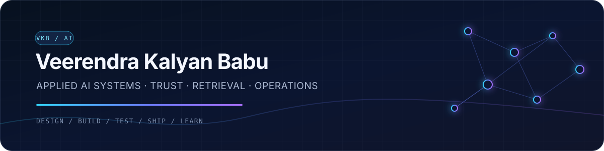

<p align="center">
  
</p>

<p align="center">
  <strong>Applied AI systems · RAG · Agent governance · Prompt infrastructure · Cloud engineering</strong>
</p>

<p align="center">
  <a href="https://www.linkedin.com/in/veerendrakalyanbabu/">LinkedIn</a>
  ·
  <a href="https://github.com/veerendrakalyanbabu-VKB?tab=repositories">All repositories</a>
  ·
  <a href="mailto:veerendra.kalyanbabu@gmail.com">Email</a>
</p>

---

## Engineering profile

I build working AI applications that connect model capabilities with the parts that make software dependable: retrieval, structured data, policy enforcement, evaluation, observability, security boundaries, and deployment.

My background includes more than five years in US IT staffing, recruitment operations, and client management. That experience shapes how I build: start from the operating problem, define the decisions the system must support, and make the result understandable to the people who use it.

I am currently focused on production-minded GenAI engineering with Python, TypeScript, RAG, agentic workflows, GCP, and Cloudflare.

## Selected systems

| Project | Engineering problem | Implementation evidence |
|---|---|---|
| **[Instruxa](https://github.com/veerendrakalyanbabu-VKB/Instruxa)** | Treat prompts as versioned, measurable AI assets instead of disposable chat text | React + TypeScript, Cloudflare Workers/D1, encrypted BYOK, OpenAI/Claude/Gemini gateway, response evaluation, Stripe sandbox billing · **[Live](https://still-darkness-9403.veerendra-kalyanbabu.workers.dev/)** |
| **[OpenWorld](https://github.com/veerendrakalyanbabu-VKB/OpenWorld)** | Put a deterministic trust boundary between an AI agent and real-world execution | FastAPI + Next.js, capability and policy checks, risk decisions, human approval, verification, audit trails · **[Live](https://openworld-web.onrender.com/)** |
| **[Recruitment Intelligence Platform](https://github.com/veerendrakalyanbabu-VKB/Recruitment-Intelligence-Platform)** | Convert staffing exports into reliable operational decisions | Python, Streamlit, Pandas, DuckDB, schema normalization, funnel analytics, data-quality checks, tested KPI calculations · **[Live](https://recruitment-analytics-platform-vkb.streamlit.app/)** |
| **[NexusDocs AI](https://github.com/veerendrakalyanbabu-VKB/NexusDocs-AI)** | Answer questions from uploaded documents with traceable retrieved context | Python, Streamlit, document parsing, chunking, embeddings, FAISS retrieval, grounded generation · **[Live](https://nexusdocs-ai.streamlit.app/)** |
| **[Astra Platform](https://github.com/veerendrakalyanbabu-VKB/Astra-Platform)** | Explore a local-first command surface for memory, knowledge, voice, and specialized agents | Python, Streamlit, Three.js interface, intent routing, local memory, knowledge graph, provider bridge · **[Live](https://astra-platform-os.streamlit.app/)** |

## What the portfolio demonstrates

```text
Product problem
    → explicit architecture and trust boundaries
    → deterministic core behavior
    → AI integration where it adds measurable value
    → tests, telemetry, deployment, and documented limitations
```

- **AI application engineering:** multi-provider model gateways, RAG pipelines, prompt compilation, evaluation, and agent workflows.
- **Backend and trust:** FastAPI, Cloudflare Workers, REST APIs, authentication, authorization, encryption, policy enforcement, and auditability.
- **Data systems:** Python, SQL, Pandas, DuckDB, BigQuery concepts, data validation, operational KPIs, and analytical workflows.
- **Product delivery:** React, TypeScript, Next.js, Streamlit, GitHub Actions, Docker, Cloudflare, Render, and GCP foundations.

## Engineering principles

1. **Make the boundary explicit.** Identity, authorization, provider credentials, and commercial state belong on the server.
2. **Keep deterministic behavior testable.** AI is one component of the system, not a substitute for application logic.
3. **Show evidence.** A useful portfolio includes runnable software, architecture, tests, failure modes, and honest limitations.
4. **Design for operators as well as users.** Logs, metrics, recovery paths, and deployment documentation are product features.
5. **Prefer depth over demo count.** Each flagship project is being strengthened toward a clear production standard.

## Current direction

- Evaluation and regression testing for RAG and model responses
- Secure tool execution and human-in-the-loop agent governance
- Cost, latency, quality, and reliability observability for AI applications
- Cloud-native deployment patterns across GCP and Cloudflare

## Contact

I am open to **AI Engineer, GenAI Engineer, Applied AI, and Python AI Engineer** opportunities where I can build and improve real systems.

- [LinkedIn](https://www.linkedin.com/in/veerendrakalyanbabu/)
- [GitHub](https://github.com/veerendrakalyanbabu-VKB)
- [Email](mailto:veerendra.kalyanbabu@gmail.com)

