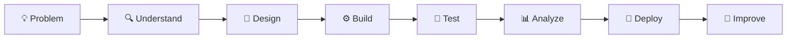

# Veerendra Kalyan Babu — Advanced Visual GitHub Profile README

````markdown
<div align="center">


<h3>
Building practical AI systems, data products and intelligent applications.
</h3>

<p>
  
</p>

<a href="https://www.linkedin.com/in/veerendrakalyanbabu/">
  
</a>
<a href="https://github.com/veerendrakalyanbabu-VKB">
  
</a>


</div>

---

# 👨‍💻 About Me

```text
Name        : Veerendra Kalyan Babu
Focus       : AI • GenAI • RAG • Python • Data • Cloud
Approach    : Learn → Build → Test → Improve → Ship
Current     : Building intelligent applications and AI systems
Goal        : Becoming a strong end-to-end AI / GenAI Engineer
````

I build practical, portfolio-driven applications that combine **Python, Data, Generative AI, RAG, analytics and cloud technologies**.

My approach is simple:

> **Understand the problem → Build the system → Validate the output → Keep improving.**

---

# ⚡ Engineering Dashboard

<div align="center">


</div>

<div align="center">


</div>

---

# 📊 Contribution Activity

<div align="center">


</div>

---

# 🧠 What I Build

<div align="center">

| 🤖 AI & GenAI       | 📄 Intelligent Documents | 📊 Data Intelligence | ☁️ Cloud Systems |
| ------------------- | ------------------------ | -------------------- | ---------------- |
| RAG Applications    | Document Q&A             | Analytics Platforms  | GCP              |
| AI Workflows        | Embeddings               | Dashboards           | Cloud Storage    |
| Vector Search       | Semantic Retrieval       | KPI Analysis         | BigQuery         |
| Intelligent Systems | Context-Aware AI         | Data Processing      | AI Platforms     |

</div>

---

# 🚀 Featured Projects

<div align="center">

## 🧠 OpenWorld

### The Trust Layer for the Agentic Internet

**Human Intent → Policy → AI Execution → Approval → Audit → Verifiable Results**

An exploration of how intelligent and autonomous systems can operate within a framework of trust, governance, policy controls, human approval and auditable execution.

[](https://openworld-web.onrender.com/)

`Agentic AI` • `Governance` • `Policy` • `Human Approval` • `Auditability`

---

## 📄 NexusDocs AI

### AI-Powered Document Intelligence

```text
Documents
    │
    ▼
Text Extraction
    │
    ▼
Chunking & Processing
    │
    ▼
Embeddings
    │
    ▼
Vector Search
    │
    ▼
Context Retrieval
    │
    ▼
AI-Generated Answer
```

An AI-powered **Retrieval-Augmented Generation (RAG)** application for exploring documents and generating context-aware answers grounded in retrieved information.

[](https://nexusdocs-ai.streamlit.app/)

`Python` • `RAG` • `LangChain` • `Embeddings` • `FAISS` • `Streamlit`

---

## ⚡ NexusOps AI

### Engineering & Operations Intelligence

```text
Operational Signals
       +
Infrastructure Health
       +
Incident Context
       │
       ▼
Data Processing & Analysis
       │
       ▼
Operational Intelligence
       │
       ▼
Insights & Decisions
```

An AI-powered engineering and operations intelligence platform designed to help teams investigate infrastructure health, operational signals and incidents.

[](https://nexusops-ai-y6cvwvktst6dq2peeudqsz.streamlit.app/)

`Python` • `Streamlit` • `Pandas` • `Plotly` • `Testing` • `Operational Analytics`

---

## 📊 Recruitment Intelligence Platform

### From Recruitment Data to Actionable Insights

```text
Recruitment Data
       │
       ▼
Data Processing
       │
       ▼
Pipeline Analytics
       │
       ├──────────► Recruiter Performance
       ├──────────► Candidate Funnel
       ├──────────► Hiring Trends
       └──────────► Operational KPIs
       │
       ▼
Interactive Intelligence
```

An end-to-end analytics application designed to transform recruitment data into insights across pipelines, recruiter performance, candidate funnels and operational KPIs.

[](https://recruitment-analytics-platform-vkb.streamlit.app/)

`Python` • `Pandas` • `Streamlit` • `DuckDB` • `PyArrow` • `pytest`

</div>

---

# 🛠️ Technology Stack

<div align="center">

### Languages & Development


<br/><br/>

### AI & Generative AI


<br/>

`RAG`   `LLMs`   `Embeddings`   `Vector Search`   `LangChain`   `FAISS`   `Prompt Engineering`

<br/><br/>

### Data & Analytics


<br/>

`Pandas`   `SQL`   `DuckDB`   `PyArrow`   `Plotly`   `Power BI`

<br/><br/>

### Cloud & Application Engineering


<br/>

`Google Cloud Platform`   `BigQuery`   `Cloud Storage`   `Vertex AI`   `IAM`   `REST APIs`   `pytest`

</div>

---

# 🧭 My Engineering Workflow

<div align="center">



</div>

---

# 🎯 Currently Exploring

<div align="center">

| Area             | Current Focus                                         |
| ---------------- | ----------------------------------------------------- |
| 🧠 Generative AI | Advanced RAG architectures and intelligent workflows  |
| 🤖 Agentic AI    | Agents, orchestration and reliable execution          |
| ☁️ Cloud         | Google Cloud architecture and AI engineering          |
| 🏗️ Systems      | Scalable, maintainable application design             |
| 🧪 Quality       | Testing, validation and production-minded development |

</div>

---

# 📈 Learning & Building

```text
Python Engineering       ████████████████████░
Data & Analytics         ███████████████████░░
Generative AI / RAG      █████████████████░░░░
Cloud Engineering        ███████████████░░░░░░
Agentic AI Systems       █████████████░░░░░░░░
```

> These bars represent my **current learning and project focus**, not certified proficiency percentages.

---

# 🤝 Let's Connect

<div align="center">

### Open to connecting with professionals, engineers and teams building in:

**AI • Generative AI • RAG • Python • Data • Cloud • Intelligent Systems**

<br/>

<a href="https://www.linkedin.com/in/veerendrakalyanbabu/">
  
</a>

<br/><br/>

### 💻 Explore My Work

<a href="https://github.com/veerendrakalyanbabu-VKB?tab=repositories">
  
</a>

<br/><br/>


### 🚀 Building. Learning. Shipping. Improving.

</div>
```
