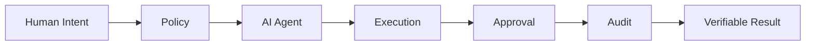
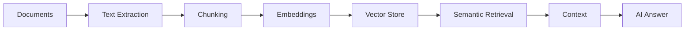
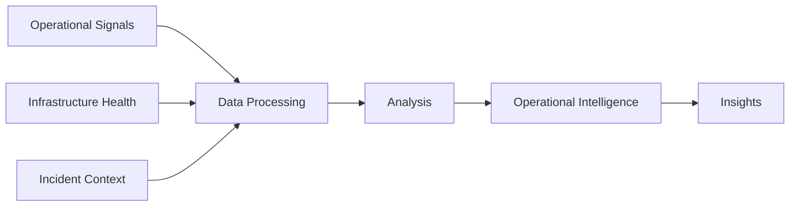
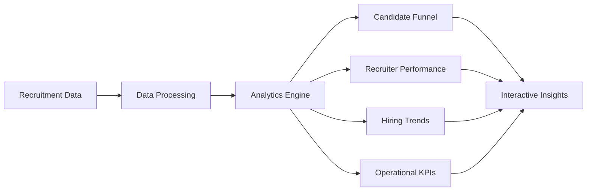
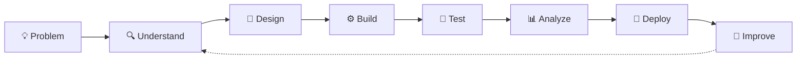

# Veerendra Kalyan Babu — VKB

````markdown
<div align="center">


<h3>Building intelligent systems that turn real-world problems into working applications.</h3>


<br/>

<a href="https://www.linkedin.com/in/veerendrakalyanbabu/">
  
</a>

<a href="https://github.com/veerendrakalyanbabu-VKB">
  
</a>

<a href="https://github.com/veerendrakalyanbabu-VKB?tab=repositories">
  
</a>

</div>

<br/>

---

# 👋 Hello, I'm Veerendra

I build practical applications across **Artificial Intelligence, Generative AI, Retrieval-Augmented Generation, Data Analytics and Cloud technologies**.

My focus is not just learning individual tools. I focus on understanding how they work together to create useful systems:

> **Problem → Data → Architecture → Intelligence → Application → Testing → Improvement**

<br/>

## 🧭 Engineering Profile

```text
━━━━━━━━━━━━━━━━━━━━━━━━━━━━━━━━━━━━━━━━━━━━━━━━━━━━━━━━━━

  FOCUS      →  AI • GenAI • RAG • Python • Data • Cloud

  BUILD      →  Intelligent applications and data products

  APPROACH   →  Learn → Build → Test → Improve → Ship

  CURRENT    →  RAG • Agentic AI • Cloud AI • System Design

  PRINCIPLE  →  Practical projects over theoretical knowledge

━━━━━━━━━━━━━━━━━━━━━━━━━━━━━━━━━━━━━━━━━━━━━━━━━━━━━━━━━━
````

---

# 🚀 Flagship Projects

> **Four projects. Four different engineering challenges. One goal: build useful intelligent systems.**

<br/>

## 🧠 OpenWorld

### The Trust Layer for the Agentic Internet

> **Human Intent → Policy → AI Execution → Approval → Audit → Verifiable Results**

OpenWorld explores how autonomous and intelligent systems can operate within a framework of **trust, governance, policy controls, human approval and auditable execution**.



**Engineering Focus**

`Agentic AI` · `AI Governance` · `Policy` · `Trust` · `Human-in-the-Loop` · `Auditability`

<a href="https://openworld-web.onrender.com/">
  
</a>

---

## 📄 NexusDocs AI

### AI-Powered Document Intelligence

NexusDocs AI is a **Retrieval-Augmented Generation (RAG)** application designed to transform documents into searchable knowledge and generate context-aware answers grounded in retrieved information.



**Engineering Focus**

`Python` · `RAG` · `LangChain` · `Embeddings` · `Vector Search` · `FAISS` · `Streamlit`

<a href="https://nexusdocs-ai.streamlit.app/">
  
</a>

---

## ⚡ NexusOps AI

### Engineering & Operations Intelligence

NexusOps AI explores how infrastructure health, incidents and operational signals can be brought together to support faster, evidence-based decisions.



**Engineering Focus**

`Python` · `Streamlit` · `Pandas` · `Plotly` · `Testing` · `Operational Analytics`

<a href="https://nexusops-ai-y6cvwvktst6dq2peeudqsz.streamlit.app/">
  
</a>

---

## 📊 Recruitment Intelligence Platform

### From Recruitment Data to Actionable Intelligence

An end-to-end analytics platform that transforms recruitment data into insights across **candidate pipelines, recruiter performance, hiring trends and operational KPIs**.



**Engineering Focus**

`Python` · `Pandas` · `Streamlit` · `DuckDB` · `PyArrow` · `pytest`

<a href="https://recruitment-analytics-platform-vkb.streamlit.app/">
  
</a>

<br/>

---

# 🛠️ Technology Ecosystem

<div align="center">

### Core Engineering


<br/><br/>

### AI & Generative AI

`Generative AI`   `LLMs`   `RAG`   `Embeddings`   `Vector Search`   `LangChain`   `FAISS`

<br/><br/>

### Data & Analytics

`Pandas`   `SQL`   `DuckDB`   `PyArrow`   `Plotly`   `Power BI`

<br/><br/>

### Cloud & Application Engineering


<br/>

`BigQuery`   `Cloud Storage`   `Vertex AI`   `IAM`   `REST APIs`   `pytest`

</div>

<br/>

---

# 🧠 How I Think About Systems



---

# 🎯 Currently Building & Exploring

<table>
<tr>
<td width="50%">

### 🧠 Generative AI

* Advanced RAG architectures
* Retrieval quality
* Context engineering
* Evaluation and validation

</td>
<td width="50%">

### 🤖 Agentic AI

* Agent workflows
* Tool orchestration
* Human approval systems
* Reliable AI execution

</td>
</tr>

<tr>
<td width="50%">

### ☁️ Cloud AI

* Google Cloud
* AI application architecture
* Vertex AI
* Cloud-native systems

</td>
<td width="50%">

### 🏗️ Engineering

* System design
* Application architecture
* Testing
* Maintainable code

</td>
</tr>
</table>

---

# 📌 Engineering Principles

<div align="center">

|                                     |                                                           |
| ----------------------------------- | --------------------------------------------------------- |
| 🧩 **Build for real problems**      | Not projects created only to demonstrate syntax           |
| 🔍 **Understand before optimizing** | Good decisions start with understanding the system        |
| 🧪 **Test assumptions**             | Validate logic and behavior instead of guessing           |
| 📈 **Improve continuously**         | Every project is an opportunity to build better           |
| 🚀 **Ship what you build**          | A working application is stronger than an unfinished idea |

</div>

---

# 🗂️ Explore the Portfolio

<div align="center">

### 🧠 AI Systems

**OpenWorld**  •  **NexusDocs AI**

### ⚙️ Intelligence & Operations

**NexusOps AI**

### 📊 Data & Analytics

**Recruitment Intelligence Platform**

<br/>

<a href="https://github.com/veerendrakalyanbabu-VKB?tab=repositories">
  
</a>

</div>

---

# 🤝 Let's Connect

<div align="center">

### Interested in connecting around:

**AI • Generative AI • RAG • Python • Data • Cloud • Intelligent Systems**

<br/>

<a href="https://www.linkedin.com/in/veerendrakalyanbabu/">
  
</a>

<a href="https://github.com/veerendrakalyanbabu-VKB">
  
</a>

<br/><br/>

### 🚀 Build intelligently. Learn continuously. Ship meaningful work.


</div>
```
