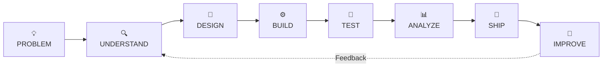
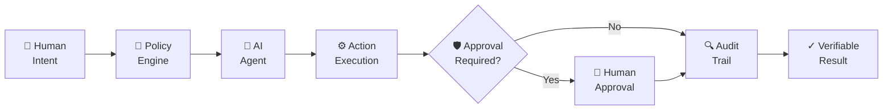
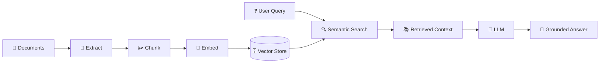
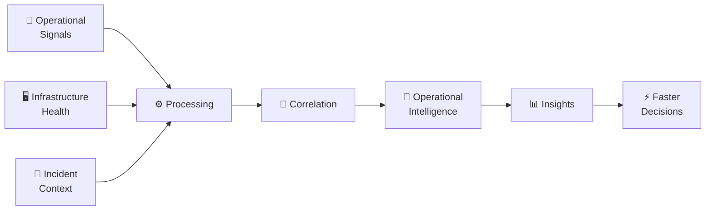
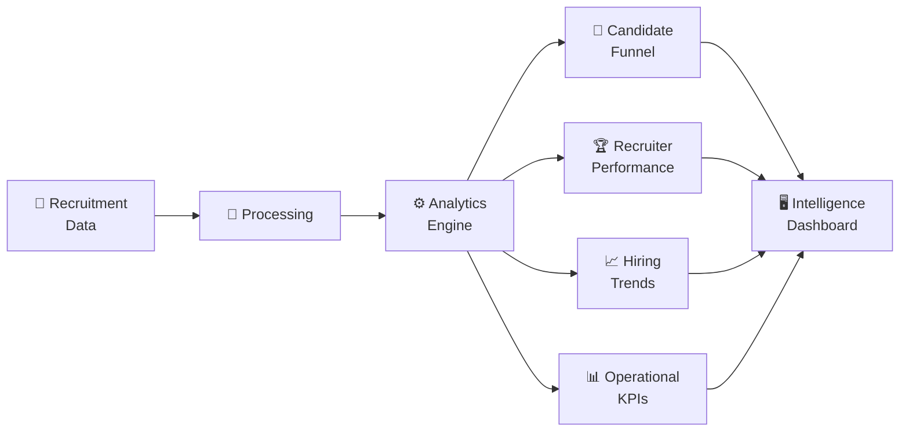
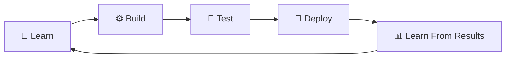

# Veerendra Kalyan Babu — AI Engineering Portfolio

````markdown
<!-- ===================================================== -->
<!--               VEERENDRA KALYAN BABU                   -->
<!--        AI / GENAI / RAG / CLOUD ENGINEERING           -->
<!-- ===================================================== -->

<div align="center">


<br/>


<br/><br/>

<a href="https://www.linkedin.com/in/veerendrakalyanbabu/">
  
</a>
&nbsp;
<a href="https://github.com/veerendrakalyanbabu-VKB">
  
</a>
&nbsp;
<a href="https://github.com/veerendrakalyanbabu-VKB?tab=repositories">
  
</a>

</div>

<br/>

<div align="center">

```text
╔══════════════════════════════════════════════════════════════════════╗
║                                                                      ║
║                 INTELLIGENT SYSTEMS • REAL PRODUCTS                 ║
║                                                                      ║
║      AI  →  DATA  →  RETRIEVAL  →  REASONING  →  DECISION           ║
║                                                                      ║
╚══════════════════════════════════════════════════════════════════════╝
````

</div>

---

# 🧠 ENGINEERING IDENTITY

<div align="center">

```text
┌────────────────────────────────────────────────────────────────────┐
│                                                                    │
│  ROLE          AI / GENERATIVE AI ENGINEER                         │
│                                                                    │
│  PRIMARY       Python • RAG • Intelligent Applications             │
│                                                                    │
│  ENGINEERING   Data • Retrieval • Automation • Cloud               │
│                                                                    │
│  MINDSET       Understand → Design → Build → Test → Improve        │
│                                                                    │
│  CURRENT       Agentic AI • Advanced RAG • Cloud AI Systems        │
│                                                                    │
└────────────────────────────────────────────────────────────────────┘
```

</div>

I build practical applications that connect **Artificial Intelligence, Generative AI, Retrieval-Augmented Generation, data processing, analytics and cloud technologies**.

The goal is simple:

> **Move beyond learning individual technologies and build complete systems that solve meaningful problems.**

---

# ⚡ THE ENGINEERING LOOP

<div align="center">



</div>

---

# 🧬 TECHNOLOGY MATRIX

<div align="center">

## CORE DEVELOPMENT


<br/><br/>

## AI & GENERATIVE AI


<br/><br/>

## DATA & INTELLIGENCE


<br/>

`Pandas`   `DuckDB`   `PyArrow`   `Plotly`   `Power BI`   `Analytics`

<br/><br/>

## CLOUD & APPLICATIONS


<br/>

`BigQuery`   `Cloud Storage`   `Vertex AI`   `IAM`   `REST APIs`   `pytest`

</div>

---

# 🚀 FLAGSHIP SYSTEMS

<div align="center">

```text
━━━━━━━━━━━━━━━━━━━━━━━━━━━━━━━━━━━━━━━━━━━━━━━━━━━━━━━━━━━━

              FOUR PROJECTS • FOUR ENGINEERING DOMAINS

     AGENTIC AI • DOCUMENT INTELLIGENCE • OPERATIONS • DATA

━━━━━━━━━━━━━━━━━━━━━━━━━━━━━━━━━━━━━━━━━━━━━━━━━━━━━━━━━━━━
```

</div>

<br/>

## 01 — 🧠 OPENWORLD

<div align="center">

### THE TRUST LAYER FOR THE AGENTIC INTERNET

**Human Intent → Policy → AI Execution → Approval → Audit → Verifiable Results**

</div>

OpenWorld explores how AI agents and autonomous systems can operate within a framework of **trust, governance, policy controls, human approval and auditable execution**.



<div align="center">

`AGENTIC AI` • `AI GOVERNANCE` • `POLICY` • `TRUST` • `HUMAN-IN-THE-LOOP`

<br/>

<a href="https://openworld-web.onrender.com/">

</a>

</div>

---

## 02 — 📄 NEXUSDOCS AI

<div align="center">

### AI-POWERED DOCUMENT INTELLIGENCE

**Upload Knowledge → Retrieve Context → Generate Grounded Answers**

</div>

A **Retrieval-Augmented Generation system** designed to transform documents into searchable knowledge and deliver context-aware responses.



<div align="center">

`PYTHON` • `RAG` • `LANGCHAIN` • `EMBEDDINGS` • `FAISS` • `VECTOR SEARCH`

<br/>

<a href="https://nexusdocs-ai.streamlit.app/">

</a>

</div>

---

## 03 — ⚡ NEXUSOPS AI

<div align="center">

### ENGINEERING & OPERATIONS INTELLIGENCE

**Signals → Correlation → Investigation → Insights → Decisions**

</div>

An operations intelligence platform designed to connect infrastructure health, operational signals and incident context.



<div align="center">

`PYTHON` • `PANDAS` • `PLOTLY` • `STREAMLIT` • `PYTEST`

<br/>

<a href="https://nexusops-ai-y6cvwvktst6dq2peeudqsz.streamlit.app/">

</a>

</div>

---

## 04 — 📊 RECRUITMENT INTELLIGENCE PLATFORM

<div align="center">

### TURNING RECRUITMENT DATA INTO ACTIONABLE INTELLIGENCE

</div>

An end-to-end analytics platform designed to turn operational recruitment data into insights across candidate pipelines, recruiter performance and hiring trends.



<div align="center">

`PYTHON` • `PANDAS` • `DUCKDB` • `PYARROW` • `STREAMLIT` • `PYTEST`

<br/>

<a href="https://recruitment-analytics-platform-vkb.streamlit.app/">

</a>

</div>

---

# 🗺️ SYSTEM PORTFOLIO

<div align="center">

```text
                              ┌───────────────┐
                              │   AI SYSTEMS  │
                              └───────┬───────┘
                                      │
                   ┌──────────────────┼──────────────────┐
                   │                  │                  │
                   ▼                  ▼                  ▼
            ┌────────────┐     ┌────────────┐     ┌────────────┐
            │  OPENWORLD │     │ NEXUSDOCS  │     │  NEXUSOPS  │
            │            │     │            │     │            │
            │ AGENTIC AI │     │ RAG / LLM  │     │ OPS INTEL  │
            └────────────┘     └────────────┘     └────────────┘
                   │                  │                  │
                   └──────────────────┼──────────────────┘
                                      │
                                      ▼
                            ┌──────────────────┐
                            │ DATA INTELLIGENCE│
                            │                  │
                            │   RECRUITMENT    │
                            │   ANALYTICS      │
                            └──────────────────┘
```

</div>

---

# 🎯 CURRENT EXPLORATION

<div align="center">

| 🧠 GENERATIVE AI    | 🤖 AGENTIC SYSTEMS | ☁️ CLOUD AI   | 🏗️ ENGINEERING |
| ------------------- | ------------------ | ------------- | --------------- |
| Advanced RAG        | Agent Workflows    | Google Cloud  | System Design   |
| Retrieval Quality   | Tool Orchestration | Vertex AI     | Architecture    |
| Context Engineering | Human Approval     | Cloud Systems | Testing         |
| Evaluation          | Reliable Execution | Deployment    | Maintainability |

</div>

---

# 🧪 ENGINEERING PRINCIPLES

<div align="center">

```text
01 ──► BUILD FOR REAL PROBLEMS
        A project should demonstrate useful engineering.

02 ──► UNDERSTAND THE SYSTEM
        Tools are useful. Architecture makes them work together.

03 ──► TEST ASSUMPTIONS
        Validate behavior instead of trusting guesses.

04 ──► SHIP WHAT YOU BUILD
        Working software creates stronger learning.

05 ──► KEEP IMPROVING
        Every project is a version, not the final destination.
```

</div>

---

# 📡 CURRENT MISSION

<div align="center">



### BUILDING TOWARD STRONGER AI ENGINEERING CAPABILITIES

**Advanced RAG • Agentic AI • Cloud AI • Production-Minded Systems**

</div>

---

# 🤝 CONNECT

<div align="center">

<h3>Let's connect and build meaningful technology.</h3>

<a href="https://www.linkedin.com/in/veerendrakalyanbabu/">

</a>

<br/><br/>

<a href="https://github.com/veerendrakalyanbabu-VKB?tab=repositories">

</a>

<br/><br/>


</div>
```
